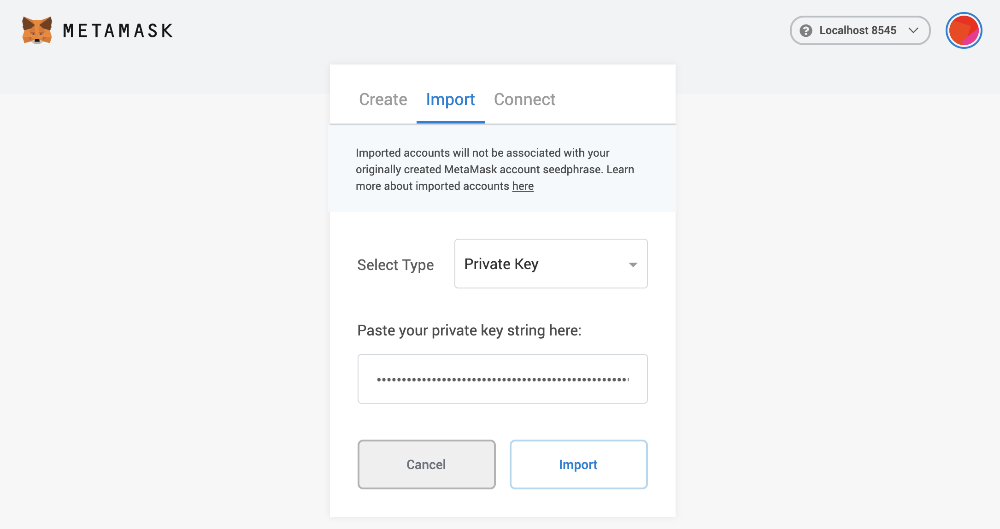

<!--
order: 2
-->

# MetaMask

Connect your MetaMask wallet with Majestic StarChain {synopsis}

The MetaMask browser extension is a wallet for accessing Ethereum-enabled applications and managing user identities. It can be used to connect to {{ $themeConfig.project.name }} through the official testnet or via a locally-running {{ $themeConfig.project.name }} node.

## Adding a New Network

Open the MetaMask extension on your browser, you may have to log in to your MetaMask account if you are not already. Then click the top right circle and go to `Settings` > `Networks` > `Add Network` and fill the form as shown below.

Here is the list of fields that you can use to paste on Metamask:

:::: tabs
::: tab Testnet

- **Network Name:** `{{ $themeConfig.project.name }} Testnet`
- **New RPC URL:** `{{ $themeConfig.project.rpc_url_testnet }}`
- **Chain ID:** `{{ $themeConfig.project.testnet_chain_id }}`
- **Currency Symbol (optional):** `{{ $themeConfig.project.testnet_ticker }}`
- **Block Explorer URL (optional):** `{{ $themeConfig.project.block_explorer_url }}`
  :::
  ::::

## Import Account to Metamask

### Manual Import

Close the `Settings`, go to `My Accounts` (top right circle) and select `Import Account`. You should see an image like the following one:

Select the `Private Key` option. Then paste the private key.

## Reset Account

If you used your Metamask account for a legacy testnet/mainnet upgrade, you will need to reset your account in order to use it with the new network. This will clear your account's transaction history, but it won't change the balances in your accounts or require you to re-enter your `Secret Recovery Phrase`.

::: warning
Make sure you download your [account state](#download-account-state) to persist public account addresses and transactions before clearing your wallet accounts.
:::

Go to `Settings` > `Advanced` and click the `Reset Account` button.

## Download Account State

To see your Metamask logs, click the top right circle and go to `Settings` > `Advanced` > `State Logs`. If you search through the JSON file for the account address you'll find the transaction history.
